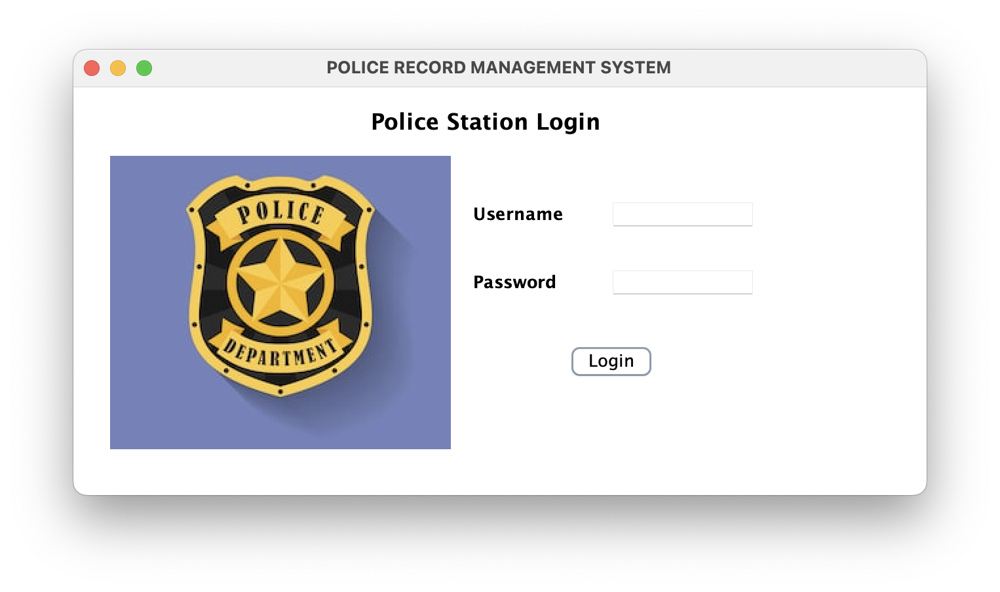
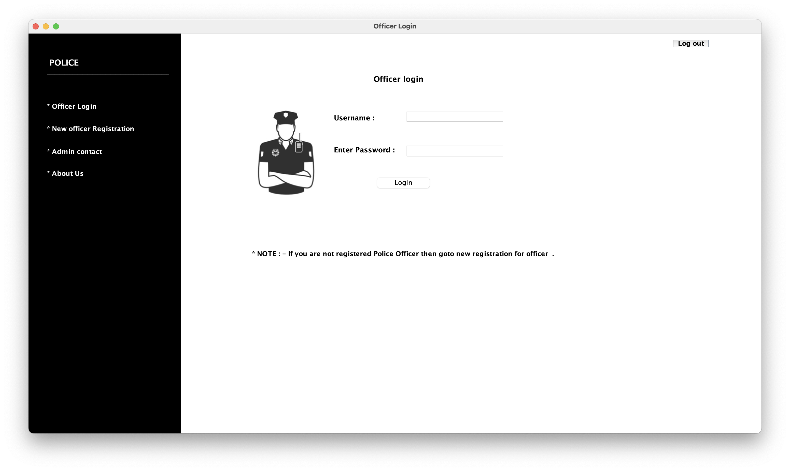

# Police-Record-Management-System

## Table of Contents
- [Introduction](#introduction)
- [Features](#features)
- [Tools and Utilities](#Tools-and-utilities)
- [Project Structure](#project-structure)
- [Screenshots](#screenshots)
- [Installation](#installation)
- [Usage](#usage)
- [License](#license)

## Introduction
The **Police Record Management System** is a comprehensive application designed to manage police records, including FIRs, cases, and criminal records. It aims to streamline the process of record-keeping and ensure that data is easily accessible and manageable by authorized personnel.

## Features
- **User Authentication:** Secure login for police officers and administrators.
- **FIR Management:** Easy creation, update, and deletion of FIR records.
- **Case Management:** Track the progress of cases, including details and involved parties.
- **Criminal Records:** Maintain a detailed database of criminal records.
- **Administrative Tools:** Tools for managing users and database integrity.

## Tools and utilities
* MySQL (Database)
* Java
  * Swing (UI)
  * AWT (UI)

## Project Structure


## Screenshots





## Installation
### Prerequisites
- Java Development Kit (JDK) 8 or higher
- MySQL Database
- Integrated Development Environment (IDE) like IntelliJ IDEA or Eclipse

### Steps
1. **Clone the repository:**
    ```sh
    git clone https://github.com/prabhuanantht/Police_Record_Management_System.git
    cd Police_Record_Management_System
    ```

2. **Setup the Database Tables and Schema:**
  - Open the `db.sql` file located in the root directory.
  - Execute the SQL scripts in your MySQL database to create the necessary tables and insert initial data.
  - Update the **database credentials** in the application source code.

3. **Build and Run the Application:**
  - Open the project in your preferred IDE.
  - Navigate to `src/UI/StationLogin.java` and run the `main` method.

## Usage
- **Login:**
  - Use the credentials provided in the database setup to log in as a police officer or system administrator(Username: "SYSTEM", Password: "SYSTEM").
- **Navigating the System:**
  - After login, you will be directed to the home screen where you can access different features of the application.
- **Managing Records:**
  - Create, update, and delete FIRs, cases, and criminal records as needed.

## License

This project is licensed under the MIT License - see the LICENSE file for details.


##
***Feel free to customize and expand upon this template to better fit the specifics of your project.

